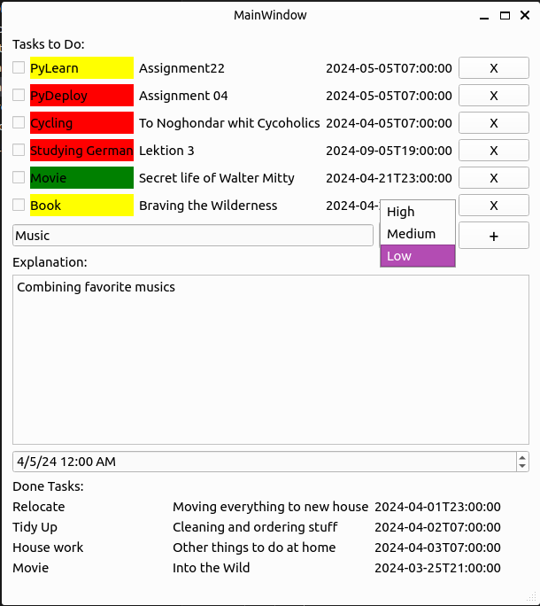

# To Do List

#### Add new tasks, set priority and time and explain the details.

###### Priority key:
High: Red, Medium: Yello,  Low: Green

## Tips:

Check the task after it's done. It will be shown in the done tasks.

Click on 'X' button it will be deleted for ever.

## How to run:
Enter 'python main.py' in terminal.

## Note:
You can also run the 'main' file.
