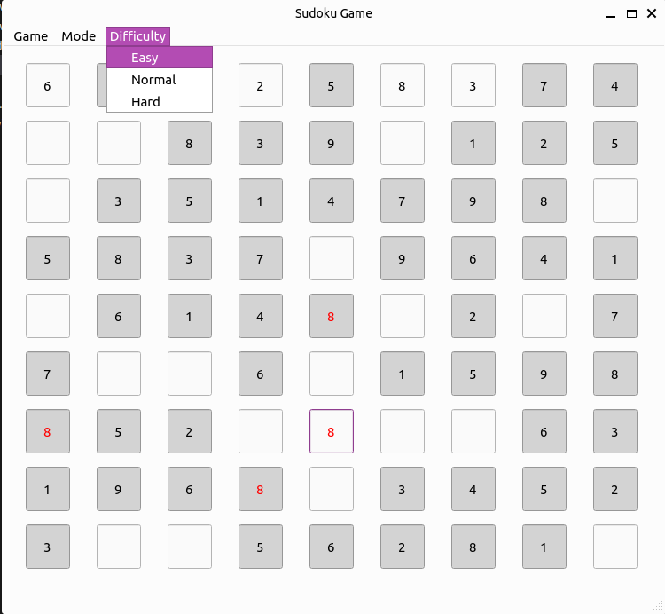

# Sudoku Game

## Rules

Each Row, Column nad 3*3 subgrid has to have all 1-9 digits.
##### Note: No repeatative number in a row, column or 3*3 subgrid is accepted!

## Features
- Difficulty modes: Easy, Normal, Hard
- Mode: Dark, Light
- Openfile: You can open a sudoku designed 9*9 txt file and enjoy the game.
- Error handling for invalid files 


## Usage
First install requiremnets:
```
pip install -r requiremnts.txt
```
Then run:
```
python main.py

```



### Note:
Not accepted digits will be shown as red.

